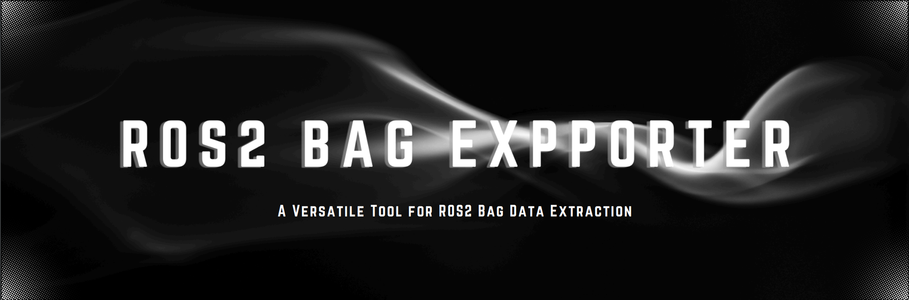

# ROS2 Bag Exporter




## Overview
ROS2 Bag Exporter is a versatile ROS 2 (Humble Hawksbill) c++ package designed to export ROS 2 bag files (rosbag2) into various formats, including images, point cloud data (PCD) files, IMU data, and GPS data. This tool facilitates the extraction and conversion of data from bag files for analysis, visualization, and processing outside the ROS ecosystem.

### Features
#### Support for Multiple Message Types:
- **PointCloud2**: Export point cloud data to PCD files.
- **Image**: Convert image messages to PNG format.
- **CompressedImage**: Convert image messages to JPG or PNG format.
- **IR Image**: Convert IR image messages to PNG format.
- **DepthImage**: Export depth images with appropriate encoding.
- **LaserScan**: Export laser scan data.
- **IMU**: Export IMU data for inertial measurement analysis.
- **GPS**: Export GPS coordinates and data.

#### Configurable Export Settings:
- Define input bag files, output directories, and storage formats via a YAML configuration file.

#### Robust Error Handling:
- Comprehensive logging for easy troubleshooting.
- Graceful shutdown on critical errors.

#### Automatic Directory Management:
- Automatically creates necessary directories for each topic based on the configuration.

## Install 
### Dependencies
Ensure that the following dependencies are installed on your system:
- ROS 2 Humble Hawksbill
- C++17 Compiler
- YAML-CPP
- OpenCV
- PCL (Point Cloud Library)
- CV Bridge
- rosbag2_cpp
- ament_index_cpp

### Installing Dependencies
You can install the necessary dependencies using apt:
```bash
sudo apt update
sudo apt install -y ros-humble-rclcpp ros-humble-rosbag2-cpp ros-humble-rosbag2-storage libyaml-cpp-dev libopencv-dev  ros-humble-cv-bridge ros-humble-sensor-msgs ros-humble-pcl-conversions ros-humble-pcl-ros libpcl-dev ros-humble-ament-index-cpp
```
*Note: Replace 'humble' with your ROS 2 distribution if different.*

### Installation
#### 1. Clone the Repository
Navigate to your ROS 2 workspace's `src` directory and clone the `ros2_bag_exporter` repository:
```bash
cd ~/ros2_ws/src
git clone https://github.com/yourusername/ros2_bag_exporter.git
```
Replace the repository URL with the actual repository URL.

#### 2. Build the Package
Return to the root of your workspace and build the package using `colcon`:
```bash
cd ~/ros2_ws
source opt/ros/humble/setup.bash
colcon build --packages-select ros2_bag_exporter
```

#### 3. Source the Workspace
After a successful build, source the workspace to overlay the new package:
```bash
source ~/ros2_ws/install/setup.bash
```
*Tip: To automatically source the workspace upon opening a new terminal, add the above command to your shell's initialization file (e.g., `~/.bashrc`).*

## Configuration
The behavior of `ros2_bag_exporter` is controlled via a YAML configuration file. By default, the configuration file is located at `config/exporter_config.yaml` within the package's share directory.

### Configuration File Structure
```yaml
bag_path: "/absolute/path/to/your/bagfile"
output_dir: "/absolute/path/to/output/directory"
storage_id: "sqlite3"  # Common storage ID; ensure it matches your bag's storage format
topics:
  - name: "/camera/depth/image_raw"
    type: "DepthImage"
    encoding: "16UC1"
    sample_interval: 10  # Write one sample every 10 messages
  - name: "/camera/color/image_raw"
    type: "Image"
    encoding: "rgb8"
    sample_interval: 5   # Write one sample every 5 messages
  - name: "/camera/color/image_raw/compressed"
    type: "CompressedImage"
    sample_interval: 5   # Write one sample every 5 messages
  - name: "/imu_topic"
    type: "IMU"
    sample_interval: 100  # Write one sample every 100 messages
  - name: "/gps_topic"
    type: "GPS"
    sample_interval: 100  # Write one sample every 100 messages
  - name: "/lidar/points"
    type: "PointCloud2"
    sample_interval: 10   # Write one sample every 10 messages
```

### Parameter Descriptions
- **bag_path**: The absolute path to the ROS 2 bag file you wish to export.
- **output_dir**: The absolute path to the directory where exported files will be saved.
- **storage_id**: Specifies the storage format of the bag file. Common values include:
  - `"sqlite3"`: Default storage for ROS 2 bags.
  - `"mcap"`: For MCAP storage format.
- **topics**: A list of topics to export. Each topic requires:
  - **name**: The ROS 2 topic name.
  - **type**: The message type (PointCloud2, Image, DepthImage, IMU, GPS, etc.).
  - **sample_interval**: The interval at which messages will be written (e.g., 100 for every 100 messages).

## Usage
After building and sourcing the workspace, run the `bag_exporter` node using the following command:
```bash
ros2 run ros2_bag_exporter bag_exporter
```

### Command-Line Arguments
- `--ros-args -p config_file:=<path_to_config>`: Specify a custom path to the YAML configuration file.

## Example
### 1. Sample Configuration
Create a configuration file at `ros2_bag_exporter/share/ros2_bag_exporter/config/exporter_config.yaml` with the following content:
```yaml
bag_path: "/home/user/rosbags/sample_bag"
output_dir: "/home/user/rosbags/exported_data"
storage_id: "sqlite3"
topics:
  - name: "/camera/depth/image_raw"
    type: "DepthImage"
    encoding: "16UC1"
    sample_interval: 10
  - name: "/camera/color/image_raw"
    type: "Image"
    encoding: "rgb8"
    sample_interval: 5
  - name: "/imu_topic"
    type: "IMU"
    sample_interval: 100
  - name: "/gps_topic"
    type: "GPS"
    sample_interval: 100
  - name: "/lidar/points"
    type: "PointCloud2"
    sample_interval: 10
```

### 2. Running the Exporter
Execute the exporter node:
```bash
ros2 run ros2_bag_exporter bag_exporter
```

### 3. Verifying the Output
Navigate to the specified output directory to find the exported files organized by topic:
```bash
cd /home/user/rosbags/exported_data
ls
```

## Troubleshooting
### 1. Package Not Found
**Error:**
```bash
Package 'ros2_bag_exporter' not found
```
**Solution:**
Ensure you have built the workspace and sourced the workspace's `setup.bash`:
```bash
source ~/ros2_ws/install/setup.bash
```

### 2. Configuration File Loading Error
**Error:**
```bash
[ERROR] [rosbag2_exporter]: Failed to load configuration: bad file: config/exporter_config.yaml
```
**Solution:**
Verify the existence and correctness of the YAML file.

### 3. Bag Storage Initialization Error
**Error:**
```bash
[ERROR] [rosbag2_storage]: No storage id specified, and no plugin found that could open URI
```
**Solution:**
Ensure that `storage_id` matches the bag file storage format (e.g., `sqlite3`).

## Contributing
Contributions are welcome! Please follow the standard process:
1. Fork the repository.
2. Create a feature branch.
3. Push your changes and submit a pull request.

## License
This project is licensed under the Apache License 2.0.

## Contact
Maintainer: Abdalrahman M. Amer 

Email: abdalrahman.m5959@gmail.com

GitHub: Geekgineer